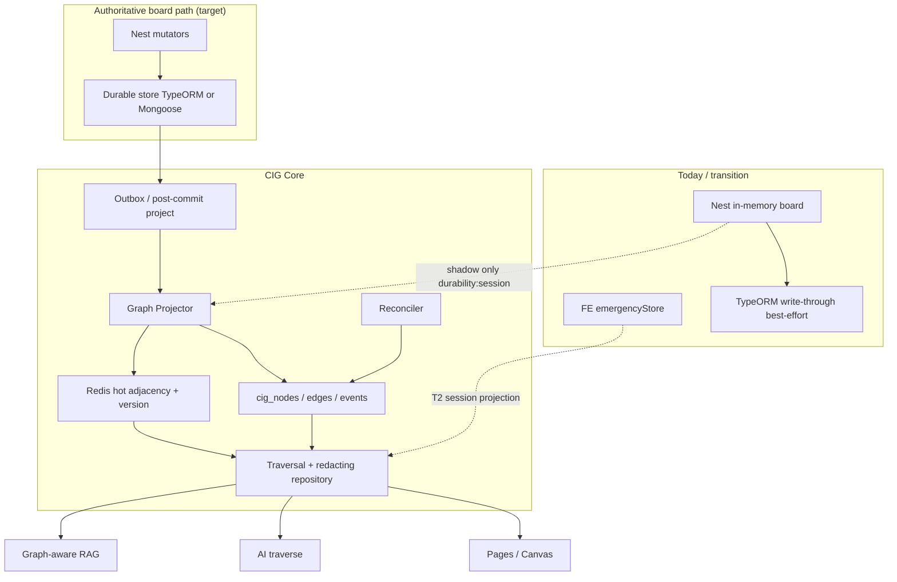
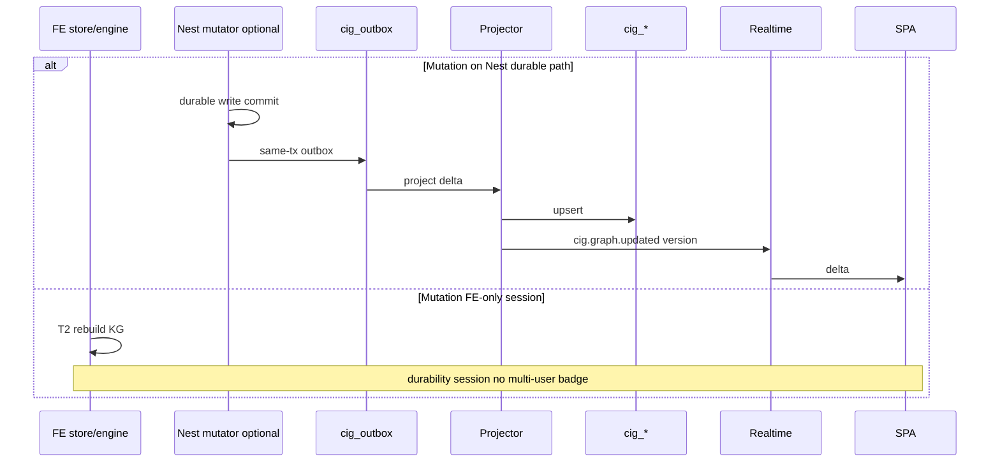

# Clinical Intelligence Graph (CIG) — Operational State Space for CareDroid

| Field | Value |
|-------|--------|
| **Document** | Clinical Intelligence Graph Design |
| **Author** | Architecture (Architect Mode) |
| **Date** | 2026-07-16 |
| **Status** | Draft (Rev 3.1 — user decisions locked) |
| **Branch context** | `architect-mode/consolidation-2026-07-15` |
| **Audience** | Senior engineers familiar with CareDroid ED surfaces |
| **Related** | `docs/architecture/architect-mode/*`, `docs/workflows/patient-journey.md`, `docs/architecture/platform-architecture-overview.md` |

---

## Overview

CareDroid today operates as a **page-centric + store-centric** Emergency Department application: a Vite + React SPA (`src/`) talking to a NestJS API (`backend/src/`). The board staff actually use is driven primarily by **`src/store/emergencyStore.ts`** plus session engines. Nest `emergency-os` holds a **parallel in-memory fixture board** with **best-effort, non-blocking TypeORM write-through** (reads still come from memory). Optional Mongoose `UnifiedPatient` may be enabled separately. Entities exist, but they are **not yet one durable, multi-user, traversable operational model**.

This design introduces the **Clinical Intelligence Graph (CIG)** — CareDroid’s **operational state space**. Inspired by the Smith Chart only as **systems-thinking philosophy** (collapse a high-dimensional system into one navigable surface where state, relationships, and optimal paths are visible), CIG is **not** an RF engineering chart and must never be implemented as one.

**Honest scope boundary (blocking):** CIG may **not** claim multi-user durable digital-twin status until a single **authoritative write path** for board mutations is durable and read-cut over (see [Source-of-Truth Reality](#source-of-truth-reality-blocking) and Key Decisions K2/K13–K21). Until then CIG is a **projection layer** with explicit durability labels, dual-read fallbacks, and StateSourceNotice honesty (Architect Mode R2).

When the write path is durable, CIG becomes the **operational graph twin** of the ED: nodes with current state, edges as real relationships, measurable transitions, AI answers via **explainable traversal paths**, pages as **filtered views**. Implementation is **incremental**, reusing engines, stores, Nest modules, RAG, and event producers while closing Stage F event-catalogue debt.

---

## Background & Motivation

### Current architecture (verified)

| Layer | Reality | Canonical paths |
|-------|---------|-----------------|
| Runtime | Single SPA + single Nest process (legacy Express still mounted) | `src/main.tsx` → `src/app/App.tsx`; `backend/src/main.ts` |
| **Client board (dominant UX SoT today)** | Zustand `emergencyStore` | `src/store/emergencyStore.ts` |
| Sync | Explicit backend sync helpers | `src/store/emergencyOperationalSync.ts` |
| **Nest emergency-os board** | **In-memory fixture arrays** as read path; TypeORM write-through is best-effort non-blocking | `EmergencyPatientService` in `backend/src/modules/emergency-os/emergency-os.services.ts` (`persistPatientToDatabase`: “Reads still come from the in-memory array”; `save().catch(...)`) |
| TypeORM entities | Tables exist for patients/rooms/staff/alerts; **not yet read SoT** for emergency-os | `backend/src/modules/emergency-os/entities/*` |
| Optional Mongoose | UnifiedPatient when `ENABLE_MONGOOSE_EMERGENCY_OS` | Platform overview |
| Journey SM | Legal transitions + move API | `src/engine/journeyEngine.ts` (`VALID_TRANSITIONS`, `movePatientToState`) |
| Workflow steps | Arrival → Discharge map | `src/config/unifiedPatientWorkflowModel.ts` |
| Stage overlays | Orchestration stages | `lib/patient-orchestration/resolveOperationalStage.ts` |
| Capacity / alerts / flow | FE engines, mostly **session** durability | `src/engine/capacityEngine.ts`, `alertEngine*.ts`, `continuousPatientFlowEngine.ts` |
| Operational intelligence | Shared rule snapshot + Nest service | `lib/operational-intelligence/*`, `emergency-os.operational-intelligence.service.ts` |
| FE knowledge graph | Session projection from store | `unifiedApplicationKnowledgeGraphModel.ts` / `Service` / `Engine` |
| Demo clinical KG | Static training graph (not live ED) | `ClinicalKnowledgeGraph.tsx`, `clinicalKnowledgeGraph.ts` |
| **Digital twin surfaces (plural)** | Express placeholder **plus multiple Nest twins** | See inventory below |
| Events | **Not a single bus** | `docs/architecture/architect-mode/event-catalogue.md` |
| AI / RAG | Claude default LLM; Pinecone/pgvector; hybrid retrieval | `backend/src/modules/rag/*`, `lib/rag/hybridRetrieval.ts` |
| Authz | Nest `Permission` + FE hospital roles | `permission.enum.ts`, permission-matrix |

### Source-of-Truth Reality (blocking)

Today there is **no single durable clinical board SoT**. Implementers must treat three parallel planes:

| Plane | What it is | Durability | Who reads it today |
|-------|------------|------------|--------------------|
| **(a) FE emergencyStore** | Zustand board: patients, rooms, queues, EMS, alerts, workflowLogs | Session + partial API sync | **Primary UX** (reception, whiteboard, queues) |
| **(b) Nest emergency-os memory + TypeORM write-through** | In-memory fixtures/mutators; TypeORM `save().catch` never fails the mutator | Memory durable only for process life; DB is **eventual best-effort shadow** | Nest emergency-os APIs, OI central node, some realtime |
| **(c) Optional Mongoose UnifiedPatient** | Document clinical domain when flag on | Durable when enabled | EMS WS paths / reassessment scheduler / legacy OS |

**TypeORM `patients` / `alerts` tables are not the read SoT.** Comments in `EmergencyPatientService` explicitly state Phase 1 write-through only, with a **future** read cutover.

#### Deploy profile authority (v1 decision — see K13)

| Profile | Authoritative **mutation** path for board | Authoritative **read** for multi-user claims | CIG projection source |
|---------|-------------------------------------------|-----------------------------------------------|------------------------|
| **Default app-only** (Mongoose off) | FE store mutations + optional Nest mutators (may diverge) | **None multi-user** until Nest read cutover | Prefer FE snapshot for T2; Nest memory for BE-only APIs; **never label T1 multi-user live** |
| **Mongoose emergency-os on** | Mongoose + Nest paths that write it (verify per endpoint) | Mongoose when that path is proven | Project from Mongoose/Nest after durable write |
| **Target (post cutover)** | Nest mutators only; TypeORM (or Mongoose) **read after write** | Nest durable store | Project **after** durable write succeeds (outbox / same-tx) |

**Blocking prerequisite for “T1 multi-user durable twin” marketing/UI badges:**

1. All board-affecting mutations funnel through Nest (or documented dual-control with conflict policy).  
2. Nest read path uses durable store (TypeORM read cutover **or** Mongoose as chosen SoT)—not fixture memory alone.  
3. FE emergencyStore becomes a **cache of Nest**, not a peer SoT.  
4. CIG projects only from post-commit durable state (consistency contract below).

Until then: CIG T1 may still be built as **best-effort shadow graph** for analytics/AI **with forced degrade labels**.

### Digital twin inventory (full)

| Surface | Path / class | Role today | CIG relationship |
|---------|--------------|------------|------------------|
| Express placeholder | `backend/src/api/digital-twin.routes.ts` via `createPlaceholderRoute` | GET `/` + `/health` only | Retire after Nest consolidation |
| Platform assets twin | `PlatformAssetsController` `@Get('digital-twin')` → `DigitalTwinService.getSnapshot` | Entitlement-scoped occupancy/fleet/IoT **demo** snapshot | Map to CIG **facility/fleet/service** nodes (non-PHI aggregates); keep entitlement packs |
| Hybrid ED twin | `EmergencyOsController` `POST/GET .../digital-twin/initialize\|simulate\|state\|scenario` → `HybridDigitalTwinService` | In-memory simulation twin for ED census/scenario | **Simulation twin** — remains separate namespace; may **seed sandbox CIG tenant**, not live T1 |
| Organizational twin | `OrganizationalDigitalTwinController` `@Controller('emergency/digital-twin/organizational')` | Org-level research/ops twin | Keep as **research/org layer**; link aggregate KPIs into CIG facility node, not patient graph |
| IoT twin | `IoTDigitalTwinService` (`backend/src/services/iot-digital-twin.service.ts`) | Device/telemetry twin snapshots | Map devices → CIG `service`/`integration` nodes; telemetry edges without PHI in metrics |
| CIG twin (this design) | Proposed `GET /api/cig/twin*` | Operational graph + time for live ED board | **Canonical live operational twin** once SoT durable; does not replace Hybrid *simulation* APIs |

### What already exists (must reuse, not rewrite)

1. **Unified Application Knowledge Graph (session projection)**  
   - 12 entity types; 13 relationship types; ids `kg:{entityType}:{sourceId}`  
   - Durability **`session`**, experimental, gated by `showOperationalIntelligenceEngine`  
   - ~850-line builder with FE-only deps (`hospitalOperatingSystemModel`, `bottleneckRegistry`, etc.) — **not** Nest-callable as-is  
   - Presentation: patient subgraph, neighbors, dashboard, copilot context  

2. **Operational intelligence “central node”**  
   - Feature vector + always `humanReviewRequired: true`; `predictions: []` empty typed array  
   - Nest: `CareDroidCentralNodeService` + `buildOperationalIntelligenceSnapshot`  

3. **Patient journey + predictions**  
   - `VALID_TRANSITIONS`; `predictPatientJourney` (FE pure-ish); continuous flow (session)  

4. **Partial graph UI**  
   - `UnifiedApplicationKnowledgeGraphPanel`; demo `/knowledge-graph` with StateSourceNotice  

### Pain points

| Pain | Impact | Evidence |
|------|--------|----------|
| Page silos | Users navigate modules, not flow | `/emergency/reception`, `/ems`, queues, whiteboard |
| **Split-brain boards** | FE store ≠ Nest memory ≠ TypeORM shadow | emergencyStore vs EmergencyPatientService |
| Session engines look multi-user | Unsafe if labeled live | shellEngineCatalog + R2 |
| Event fragmentation | No versioned catalogue | Stage F event-catalogue |
| AI answers without paths | No structured traversal | provenance exists, not graph-path-aware |
| Multiple “digital twin” APIs | Product confusion | Express + 4 Nest/service surfaces |
| Knowledge split | Ops KG vs clinical demo KG vs RAG | Three taxonomies |

### Motivation (Smith Chart systems thinking)

| Smith Chart idea | CIG analogue |
|------------------|--------------|
| Complex impedance plane | ED operational state space |
| Single navigable chart | One graph + filtered views |
| Matching networks / paths | Optimal workflow / resource paths |
| Standing wave / reflection | Bottlenecks, queue pressure, drift |
| Frequency sweep | Time: live, replay, predict |

---

## Goals & Non-Goals

### Goals

1. One **connected operational model** (clinical + ops + knowledge + infra) with honest durability labels.  
2. **Backend durable graph (T1)** when—and only when—clinical write/read SoT is durable; until then T1 is **shadow** with degrade rules.  
3. Event-driven updates with Stage F versioned catalogue; FE-session events never promote multi-user badges.  
4. Node state model with v1 required vs optional fields.  
5. AI graph navigation with **deterministic path scoring** and explainable paths.  
6. Predictive operational intelligence (advisory only).  
7. Pages as filters of the same model.  
8. **Implementable** graph-connected RAG (algorithm + type mapping + PHI gates).  
9. Infrastructure health in-graph without PHI in metrics.  
10. Incremental PR plan with consistency/reconciler **before** dual-read claims multi-user truth.

### Non-Goals

1. Literal Smith Chart UI / RF math.  
2. Microservice mesh or Neo4j for v1.  
3. Autonomous clinical decisions / auto-acuity.  
4. Claiming multi-user live twin while FE and Nest boards diverge.  
5. Replacing TypeORM/Mongoose clinical entities with graph-only storage.  
6. Full FHIR R4 graph in v1.  
7. Multi-hospital federation in v1.  
8. Kitchen-sink canvas (replay + simulation + all actions) in first canvas PR — MVP is read-only inspector.

---

## Proposed Design

### Design thesis

> **CIG is the operational graph projection of the authoritative board; pages are lenses; engines are projectors; events are the heartbeat; AI is a pathfinding + explanation agent over verified hops only.**

### High-level architecture



### Two-tier truth model (revised)

| Tier | Name | Technology | Durability claim allowed |
|------|------|------------|---------------------------|
| **T0a** | Client board | Zustand emergencyStore | **session** (until Nest cache) |
| **T0b** | Nest board memory | EmergencyPatientService arrays | **process-local** (not multi-user durable) |
| **T0c** | Durable clinical tables/docs | TypeORM shadow today; future read SoT **or** Mongoose | durable when **read** path uses them |
| **T1** | CIG operational graph | Postgres cig_* + Redis hot | durable multi-user **only if projected from T0c after successful write** |
| **T2** | UI/engine projections | KG store, session engines | session unless T1 freshness OK |

**Rule:** Never claim multi-user “live digital twin” for T0a/T0b/T2-only data. Align with `StateSourceNotice` and `shellEngineCatalog`.

### Consistency contract (required before dual-read)

#### C1. Projection trigger

| Mode | When | Claim |
|------|------|-------|
| **A. Post-durable-write (target)** | After clinical durable write **succeeds** (TypeORM/Mongoose commit), insert outbox row **same transaction** when possible; projector consumes outbox | T1 may be labeled durable |
| **B. Best-effort shadow (transition)** | Project from Nest memory / FE snapshot without durable ack | Nodes/edges must set `durability: 'session'`; twin badges forbidden |
| **C. Explicit degrade** | Durable write fails or outbox lag > SLA | Do not advance T1 version for that entity; emit metric; UI falls back |

**Outbox decision (K14):** v1 uses **transactional outbox table** `cig_outbox` when dual-writing from Nest after durable path exists. Until TypeORM read cutover, projection from Nest memory is Mode B only.

#### C2. Versioning

Field ownership (avoid conflating node revision with tenant watermark):

| Field | Scope | Meaning |
|-------|-------|---------|
| `sourceUpdatedAt` | **per node** | SoT entity `updatedAt` / mutation timestamp |
| `version` | **per node** | Monotonic content revision for that node (increments on project change) |
| `contentHash` | **per node** (optional) | Hash of projected clinical/ops state fields for reconciler equality |
| `projectorGeneration` | **per node** (copied from deploy) | Semver/build id of projector rules that last wrote the node |
| `graphVersion` / `snapshotVersion` | **per tenant snapshot only** (`cig_snapshots.version`, response header) | Monotonic tenant-wide projector watermark — **not** duplicated as a free-floating node counter without snapshot context |

Each `CigNode` carries the **per-node** fields above (see Canonical node record). Dual-read freshness uses tenant `snapshotVersion` + `generatedAt` + `freshnessMs`, not node `version` alone.

#### C3. Dual-read rule (FE / AI / canvas)

```
IF CIG_DURABLE_ENABLED
   AND t1.freshnessMs <= FRESH_MS (120_000)
   AND t1.snapshotVersion acknowledged
   AND no open reconciler conflict for requested entityIds
THEN serve T1 (redacted for role)
ELSE serve T2/SoT fallback
     mark response.durability = 'session'
     set StateSourceNotice / API header X-CIG-Degraded: true
     AI traverse MUST refuse unverified hops or return degraded:true without clinical path claims
```

**Conflict policy:** If T1 `patient.roomId` / `state` ≠ SoT for same `sourceUpdatedAt` window, **do not silently merge**. Surface conflict count; exclude those nodes from AI path explanations; show StateSourceNotice.

#### C4. Reconciler (ships with dual-read, not end-state)

- Job: compare durable clinical SoT (or Nest memory in Mode B) vs `cig_nodes` for active patients/rooms/alerts.  
- On delta: repair T1 or mark conflict; never invent clinical facts.  
- Contract tests: dual-write then read; kill projector then reconcile; force T2 fallback on stale.

#### C5. Lag SLA

| Signal | Threshold | Action |
|--------|-----------|--------|
| Projector lag p95 | **200ms** target; **500ms** warn | Metric + log |
| Projector lag p95 | **> 2s** | Dual-read force degrade; page banner |
| Snapshot age | **> 2 min** | Treat as OI “stale”; dual-read fallback |
| Outbox depth | **> 1000** or age **> 5s** | Backpressure: coalesce high-chatter events; alert |

### Evolution from existing KG

| Today (FE session) | CIG target |
|--------------------|------------|
| `buildUnifiedApplicationKnowledgeGraph` in browser | Pure builder over **neutral DTO** in `lib/cig`; FE + Nest **adapters** |
| `kg:{type}:{id}` | Canonical `cig:{tenant}:{type}:{sourceId}` + `kg:` alias |
| Thin nodes | Rich `CigNodeState` with **v1 required subset** |
| Edges no time/confidence | `validFrom`/`validTo`, confidence, evidenceRefs, durability |
| No traversal API | Nest traverse + deterministic scorer |
| Experimental engine | Durable only after SoT cutover + freshness OK |

---

## Node & Edge Schemas

### Node taxonomy (CIG)

Extend operational KG types; map clinical demo KG separately (see RAG section).

| Domain | Node types | Source today |
|--------|------------|--------------|
| Clinical ops | `patient`, `encounter`, `note`, `order`, `diagnostic`, `observation`, `medication`, `referral` | Patient, timeline |
| Space / capacity | `department`, `room`, `bed`, `queue`, `facility` | rooms, queues, hospital map |
| People / EMS | `staff`, `ems_unit`, `ambulance`, `crew` | staff, EMSArrival |
| Workflow | `workflow_step`, `task`, `alert`, `notification`, `checklist` | logs, automation, alerts |
| Knowledge | `document`, `policy`, `protocol`, `calculator`, `pathway`, `ai_recommendation`, `ai_agent`, `simulation` | registry + clinical KG seed |
| Platform | `service`, `integration`, `model` | bottleneckRegistry, modelRegistry |

**PHI rule:** Clinical nodes may carry PHI only behind `READ_PHI`. Platform/service nodes **forbid** patient identifiers in metrics/metadata (schema-enforced allow-list).

### Canonical node record

```typescript
/** lib/cig/types.ts */
export type CigNodeId = string; // cig:{tenantId}:{entityType}:{sourceId}
export type CigDurability = 'durable' | 'session' | 'ephemeral';

export type CigNodeState = {
  status: string;
  health?: 'healthy' | 'degraded' | 'critical' | 'unknown';
  latencyMs?: number | null;
  risk?: number;
  confidence?: number;
  priority?: string | null;
  ownerId?: string | null;
  ownerRole?: string | null;
  timeInStateMs?: number | null;
  predictedNextState?: string | null;
  predictedAt?: string | null;
  blockingIssues?: string[];
  requiredActions?: string[];
  evidenceQuality?: 'high' | 'medium' | 'low' | 'unknown';
  aiConfidence?: number | null;
  humanReviewRequired: boolean;
  dependencies?: CigNodeId[];
};

export type CigNode = {
  id: CigNodeId;
  tenantId: string;
  organizationId?: string;
  workspaceId?: string;
  entityType: string;
  sourceId: string;
  sourceModule: string;
  label: string;
  summary?: string;
  route?: string;
  severity?: 'critical' | 'warning' | 'info' | 'neutral';
  state: CigNodeState;
  /** Schema-constrained per entityType — unknown keys rejected at project boundary */
  metadata: Record<string, string | number | boolean | null>;
  phiClass: 'none' | 'indirect' | 'direct';
  durability: CigDurability;
  /** C2: SoT mutation time */
  sourceUpdatedAt: string;
  /** C2: per-node content revision (not tenant watermark) */
  version: number;
  /** C2: projector rules build/semver that last wrote this node */
  projectorGeneration: string;
  /** C2: optional hash of projected state for reconciler */
  contentHash?: string;
  /**
   * Optional denorm of last tenant snapshot that included this node.
   * Authoritative tenant watermark remains `cig_snapshots.version` / API `snapshotVersion`.
   */
  lastGraphVersion?: number;
  updatedAt: string;
  createdAt: string;
  /** Soft-archive: when set, node is inactive for hot snapshot but retained for replay */
  archivedAt?: string | null;
  auditCursor?: string;
};

/** Tenant snapshot envelope (not a node) */
export type CigTenantSnapshotMeta = {
  tenantId: string;
  snapshotVersion: number; // === cig_snapshots.version / graphVersion watermark
  generatedAt: string;
  freshnessMs: number;
  projectorGeneration: string;
  nodeCount: number;
  edgeCount: number;
};
```

### Node state v1 required vs optional

| Entity type | **v1 required** state/metadata | Optional until later |
|-------------|-------------------------------|----------------------|
| `patient` | `status` (= PatientState), `priority`, `timeInStateMs`, `humanReviewRequired`, metadata.state/priority | aiConfidence, predictedNextState, evidenceQuality |
| `room` / `bed` | `status` (Occupied/Blocked/…), occupant sourceId in metadata only if READ_PHI path | risk, latency |
| `queue` | count, `breached` in metadata, severity from breach | predictions |
| `staff` | role, status, active patient **count** (not names without PHI) | load predictions |
| `alert` | severity, acknowledged, patientId edge (not free text PHI in service nodes) | — |
| `service` | health, latencyMs, errorRate (allow-listed keys only) | — |
| `diagnostic` | status pending/resulted | confidence |
| `ai_recommendation` | humanReviewRequired=true, confidence | — |
| `calculator` / `protocol` | label, route | — |
| default | `status` or `'unknown'`, `humanReviewRequired` | all rich fields |

**Mapping from current thin KG node:** `severity` + `metadata` seed state; missing fields are **omitted or null**, never fabricated “intelligence.” UI must not treat null confidence as 0.9.

### Canonical edge record

```typescript
export type CigEdge = {
  id: string;
  tenantId: string;
  type: string;
  fromId: CigNodeId;
  toId: CigNodeId;
  label?: string;
  weight?: number; // scorer input; product-owned defaults in pathScore.ts
  confidence?: number;
  validFrom: string;
  validTo?: string | null; // null = current
  sourceModule: string;
  evidenceRefs?: string[];
  durability: CigDurability;
  metadata?: Record<string, string | number | boolean | null>;
};
```

### Relationship vocabulary

**Keep** `KNOWLEDGE_GRAPH_RELATIONSHIP_TYPES`. **Add:** `transitions_to`, `ordered`, `resulted_from`, `documents`, `cites`, `blocks`, `predicts`, `serves`, `arrives_as`.

### Example clinical chain

```
Room:12 ←located_in— Patient:P —part_of→ Diagnostic(lab pending)
  Diagnostic —blocks→ Patient
  Service(lab_analyzer degraded) —affects→ Diagnostic
  Staff(nurse high load) —assigned_to→ Patient
  Queue(results breached) ←waiting_in— Patient
  AI_Recommendation —recommends→ Patient —cites→ Diagnostic
```

---

## Living Operational Graph — Event Ingestion

### Event schema (Stage F)

```typescript
export type CigDomainEvent = {
  name: string;
  version: number;
  eventId: string;
  tenantId: string;
  organizationId?: string;
  workspaceId?: string;
  occurredAt: string;
  receivedAt: string;
  producer: string;
  durability: CigDurability;
  piiClassification: 'none' | 'indirect' | 'direct';
  authz: { requiredPermissions: string[] };
  payload: Record<string, unknown>; // validated per event schema; no freeform PHI keys outside allow-list
  correlationId?: string;
  causationId?: string;
};
```

### Producer map (split by reality)

#### BE-emitted now (or near-term Nest)

| Event | Producer | T1 eligibility |
|-------|----------|----------------|
| Nest patient create/update/state (memory path) | EmergencyPatientService | Mode B session until durable read cutover |
| `operational_intelligence_updated` | OI Nest service | session/durable per settings |
| `bottleneck_detected` | OI Nest publish | as above |
| `whiteboard_snapshot` / central_node_snapshot | EmergencyRealtimeService | snapshot only |
| audit.phi.access | audit module | durable audit, not board graph |
| workflow log when written via Nest WorkflowActionLogService | Nest | durable **only if** that service persists (today often memory) |

#### FE-session until promoted (exclude multi-user twin badge)

| Event | Producer | Notes |
|-------|----------|-------|
| `patient.created` / `updated` / `queue.moved` (store path) | emergencyStore / queueAssignment | durability: session |
| `reassessment.due` | reassessmentEngine | session timers |
| `capacity.changed` (engine path) | capacityEngine | session unless API snapshot overwrites |
| `ems.arrival.converted` (FE convert) | convertEmsArrivalForReception | mixed |
| workflow.action.logged (store only) | emergencyStore | **not** multi-user |

#### Not available for T1 until wired

| Event | Gap |
|-------|-----|
| Full FHIR observation stream | interoperability normalized events partial |
| Durable reassessment scheduler without Mongoose | cron only when Mongoose on |

**Ingestion sequence (honest FE path):**



### In-process bus + backpressure

- Transport: Nest `CigEventBus` (EventEmitter), same family as `EmergencyRealtimeService`.  
- **Micro-batch:** 50–100ms window coalesce events by `(tenantId, entityType, sourceId)`.  
- **Max queue depth:** 2000; on overflow drop intermediate `capacity.changed` / OI ticks, keep latest; never drop patient state transitions without metric `cig_events_dropped_total`.  
- High-chatter coalesce keys: `capacity.changed`, `operational_intelligence_updated`, continuous flow ticks.  
- Lag > dual-read thresholds → C3 degrade.

---

## Storage Choice & Physical Design

### Decision: Postgres adjacency + Redis hot adjacency (v1)

Neo4j rejected for single-ED scale; FE-only rejected as end state.

### DDL (implementable)

```sql
CREATE TABLE cig_nodes (
  id                   text PRIMARY KEY,
  tenant_id            text NOT NULL,
  organization_id      text,
  workspace_id         text,
  entity_type          text NOT NULL,
  source_id            text NOT NULL,
  source_module        text NOT NULL,
  label                text NOT NULL,
  summary              text,
  route                text,
  severity             text,
  state_json           jsonb NOT NULL,
  metadata_json        jsonb NOT NULL DEFAULT '{}',
  phi_class            text NOT NULL,
  durability           text NOT NULL,
  source_updated_at    timestamptz NOT NULL,
  version              int NOT NULL,              -- per-node content revision
  projector_generation text NOT NULL DEFAULT '0',
  content_hash         text,
  last_graph_version   bigint,                   -- denorm of tenant watermark
  archived_at          timestamptz,              -- soft-archive only (v1: never hard-delete)
  created_at           timestamptz NOT NULL,
  updated_at           timestamptz NOT NULL,
  audit_cursor         text,
  UNIQUE (tenant_id, entity_type, source_id)
);
CREATE INDEX cig_nodes_tenant_type ON cig_nodes (tenant_id, entity_type);
CREATE INDEX cig_nodes_tenant_updated ON cig_nodes (tenant_id, updated_at DESC);
CREATE INDEX cig_nodes_tenant_phi ON cig_nodes (tenant_id, phi_class);
CREATE INDEX cig_nodes_tenant_active ON cig_nodes (tenant_id)
  WHERE archived_at IS NULL;

-- FK: NO ACTION / RESTRICT — soft-archive keeps rows so historical edges remain valid for twin replay.
-- v1 forbids hard DELETE of nodes that still have any cig_edges reference.
CREATE TABLE cig_edges (
  id            text PRIMARY KEY,
  tenant_id     text NOT NULL,
  type          text NOT NULL,
  from_id       text NOT NULL REFERENCES cig_nodes(id) ON DELETE RESTRICT,
  to_id         text NOT NULL REFERENCES cig_nodes(id) ON DELETE RESTRICT,
  label         text,
  weight        double precision,
  confidence    double precision,
  valid_from    timestamptz NOT NULL,
  valid_to      timestamptz,  -- NULL = current
  source_module text NOT NULL,
  evidence_json jsonb,
  durability    text NOT NULL,
  metadata_json jsonb
);
-- Current-edge uniqueness (prevents dual-write retry duplicates)
CREATE UNIQUE INDEX cig_edges_current_uniq
  ON cig_edges (tenant_id, type, from_id, to_id)
  WHERE valid_to IS NULL;
CREATE INDEX cig_edges_from_current ON cig_edges (tenant_id, from_id) WHERE valid_to IS NULL;
CREATE INDEX cig_edges_to_current ON cig_edges (tenant_id, to_id) WHERE valid_to IS NULL;
CREATE INDEX cig_edges_type_current ON cig_edges (tenant_id, type) WHERE valid_to IS NULL;

CREATE TABLE cig_events (
  event_id      text PRIMARY KEY,
  tenant_id     text NOT NULL,
  name          text NOT NULL,
  version       int NOT NULL,
  occurred_at   timestamptz NOT NULL,
  producer      text NOT NULL,
  durability    text NOT NULL,
  pii_class     text NOT NULL,
  payload_json  jsonb NOT NULL,
  correlation_id text
) PARTITION BY RANGE (occurred_at);  -- monthly partitions recommended

CREATE TABLE cig_outbox (
  id            bigserial PRIMARY KEY,
  tenant_id     text NOT NULL,
  event_id      text NOT NULL,
  payload_json  jsonb NOT NULL,
  created_at    timestamptz NOT NULL DEFAULT now(),
  processed_at  timestamptz
);
CREATE INDEX cig_outbox_unprocessed ON cig_outbox (created_at) WHERE processed_at IS NULL;

CREATE TABLE cig_snapshots (
  tenant_id     text PRIMARY KEY,
  version       bigint NOT NULL,
  generated_at  timestamptz NOT NULL,
  node_count    int NOT NULL,
  edge_count    int NOT NULL,
  redis_key     text
);
```

### Traversal execution strategy (v1 pick)

| Path | Strategy |
|------|----------|
| **Live ≤6 hop BFS** (AI, canvas neighborhood) | Load **hot adjacency from Redis** (or memory snapshot): `adj[fromId] = [{toId, type, weight, severity…}]` for **current edges only** (`valid_to IS NULL`). BFS in `lib/cig/traverse.ts`. **No recursive CTE on hot path.** |
| **Cold / replay / audit** | SQL: fetch nodes/edges by time window; app-layer walk historical edges including closed `valid_to`. |
| **Reconciler / bulk** | SQL set comparisons by `(entity_type, source_id)`. |

### Hot-set pruning & snapshot size

- Active graph: patients not in Discharge/Deceased **or** discharged within retention window (**36 hours default** — **K19**, config-overridable).  
- **Soft-archive only (v1):** after the **36h** discharged retention, set `archived_at = now()` and exclude from Redis hot adjacency / default snapshot (`WHERE archived_at IS NULL`). **Do not hard-delete** `cig_nodes` rows while any `cig_edges` reference them (`ON DELETE RESTRICT`). Closed edges keep `valid_to` set; historical rows stay for `/twin/replay`.  
- Optional later (not v1): move fully cold rows to `cig_nodes_archive` / `cig_edges_archive` **without** live FKs; only after replay window expires (e.g. 30–90d).  
- Current edges only in Redis; closed + archived edges Postgres-only.  
- Cap workflow log / operational_event nodes at **N=40** recent (match FE builder).  
- Measure fan-out: run existing FE builder on seed + peak board; **validate 2–5 MB** claim before locking p95; if > 8 MB, cluster by department in snapshot API.  
- Event log: partition + retain 30–90 days operational detail.

### Redis / PHI

- Key: `cig:snap:{tenantId}:{version}` and `cig:adj:{tenantId}`.  
- **Tenant isolation:** no cross-tenant keys; optional Redis ACL per env.  
- Snapshots containing `phi_class=direct` nodes: treat as PHI store — encrypt at rest if Redis not in private VPC; **never** put full PHI snapshots on public CDN.  
- SSE/WS subscription requires same auth as `GET /snapshot` (JWT + tenant + permission). Payload: prefer **version bump + entity id list** over full PHI delta when subscriber lacks READ_PHI.

### Write amplification

- Prefer **true delta** per event: close old edges (`valid_to=now`), upsert changed nodes, insert new edges.  
- Full patient neighborhood rebuild only on create or reconciler repair.  
- Do **not** rebuild entire tenant graph per `patient.updated`.

### Scale assumptions (single ED)

| Metric | Assumption |
|--------|------------|
| Active patients | 50–250 typical; 500 peak |
| Active nodes | ~1k–5k (validate against FE builder fan-out) |
| Events / min | 50–300 peak (coalesce ticks) |
| Hot BFS ≤6 hop | p95 **< 150ms** in-process |
| Projector p95 | **< 200ms** per coalesced batch |

---

## Projection Strategy — Pages as Filters

Same product insight: one graph, many lenses. View filters:

| View filter | Route surface | Primary node types | phiMode default |
|-------------|---------------|--------------------|-----------------|
| `reception` | `/emergency/reception` | patient(arrival/reg), queue, staff, document | full (clerk) |
| `ems` | `/emergency/ems` | ems_unit, room, patient, alert | full |
| `triage` | queues pretriage | patient, queue, calculator, alert | full |
| `whiteboard` | whiteboard | patient, room, bed, staff, alert | full |
| `capacity` | capacity | room, bed, service, department | **limited** for pure ops |
| `command` | command center | service, operational_event, ai_recommendation | limited / full by role |
| `canvas` | **`/emergency/operational-canvas`** (K20) | all (role-filtered) | role-based |

### phiMode field tables

| Mode | Patient label | MRN | Staff name | Room name | Service metrics | Affected patient **count** | Patient **node ids** |
|------|---------------|-----|------------|-----------|-----------------|----------------------------|----------------------|
| `full` | yes | yes | yes | yes | yes | yes | yes |
| `limited` | redacted (`Patient·P1`) | no | role only | yes | yes | yes | **no** (unless READ_PHI) |
| `none` | no patient nodes | no | no | zone aggregates | yes | aggregate only | no |

**Ops without READ_PHI:** may see service health + **counts** of affected patients; may **not** see patient node ids/labels on `blocks`/`affects` edges (edge endpoints redacted to `cig:…:patient:****` or omitted).

---

## Workflow Navigation

`VALID_TRANSITIONS` remains legal SM. CIG mirrors transitions as close/open workflow edges + `time_in_state_ms`. Overlays from `resolveOperationalStage` → metadata, not parallel SM.

---

## AI Navigates the Graph

### Traversal API

```http
POST /api/cig/traverse
Permissions: READ_PHI if path may include direct PHI

{
  "startNodeId": "cig:tenant:room:12",
  "goal": "explain_delay",
  "maxDepth": 6,
  "maxBranch": 8,
  "includePredictions": true
}
```

Response includes `paths[]`, `subgraph`, `degraded`, `provenance`, `humanReviewRequired: true`.

### Deterministic path scoring v1 (`lib/cig/pathScore.ts`) — product-owned coefficients

**Hard filters (before scoring):**

1. Drop edges with `validTo != null`.  
2. Drop nodes with reconciler conflict flag.  
3. Drop hops the caller is not authorized to see (after redaction, path breaks → discard path).  
4. Cycle detection: do not revisit node id.  
5. `maxDepth` / `maxBranch` enforced.

**Edge type priors `W_type` (v1 constants):**

| type | weight |
|------|--------|
| `blocks` | 1.00 |
| `affects` | 0.85 |
| `waiting_in` | 0.70 |
| `depends_on` | 0.65 |
| `part_of` / `ordered` | 0.55 |
| `assigned_to` | 0.45 |
| `located_in` | 0.40 |
| `recommends` / `cites` | 0.35 |
| `connected_to` / `triggered_by` | 0.25 |
| other | 0.20 |

**Node status bonuses `B_node` (sum, capped 1.0):**

| Condition | bonus |
|-----------|-------|
| `severity === 'critical'` | +0.35 |
| `severity === 'warning'` | +0.20 |
| `state.health === 'degraded'\|'critical'` (service) | +0.30 |
| queue `metadata.breached === true` | +0.25 |
| `timeInStateMs` > target * 1.5 (if known) | +0.20 |
| `blockingIssues.length > 0` | +0.15 |
| prediction delay kind present | +0.10 * confidence |

**Path score (higher = better explanation for `explain_delay`):**

```
score(path) =
  Σ_edges ( W_type(e) * (e.weight ?? 1) )
  + Σ_nodes B_node(n)
  - 0.05 * hopCount
  - 0.10 * (1 - min edge confidence along path if any confidence set)
```

**Ranking:** sort by `score` desc; tie-break: (1) more `blocks` edges, (2) higher max severity, (3) lexicographic path id string for determinism.

**Goals:**

| goal | Prefer edges/nodes |
|------|-------------------|
| `explain_delay` | blocks, affects, breached queues, degraded services, long timeInState |
| `find_owner` | assigned_to, ownerRole, escalated_to |
| `blocking_issues` | blockingIssues, blocks only |

**LLM contract (testable):** Model may only mention node ids/edges present in returned `paths`. Prompt includes path JSON; unit tests assert no extra edge types in structured output; `citationEntailment`-style strip for free text when available.

**Fixture:** Room 12 → Patient → pending Diagnostic → degraded lab Service must rank above room → department decorative path.

### AI stack integration

| Component | Integration |
|-----------|-------------|
| AIGatewayService | capability `cig-traverse`; phiAccessed when direct PHI |
| toolRegistry | read-only `explain_operational_path` |
| provenance | `live_operational_data` + path node ids |
| proposals | mutations still via ai-action-proposal lifecycle |

---

## Predict Future State

| Layer | Engine | Server-side rule |
|-------|--------|------------------|
| Journey | `predictPatientJourney` | Move pure function to `lib/` (or already pure) — Nest imports **shared** lib only; **no FE-only Nest call** |
| Flow congestion | continuousPatientFlow | Either share pure snapshot builder in `lib/` or keep predictions **T2-only** until shared |
| Capacity / EMS / OI | capacity + OI | Nest OI already server-side |
| Empty OI predictions[] | fill from shared rules | advisory nodes |

**v1 decision (K17):** Ship **server-side** predictions only for functions already pure/shared (`predictPatientJourney` after lib placement, OI scores). Continuous flow predictions remain T2 until extracted. Never Nest-import `src/engine/*` that touches Zustand.

Prediction node shape unchanged; `humanReviewRequired: true`.

---

## Unified Knowledge Graph + RAG (implementable)

### Clinical demo KG → CIG type mapping

| `clinicalKnowledgeGraph` type | CIG `entityType` | notes |
|------------------------------|------------------|-------|
| `calculator` | `calculator` | seed durable catalog |
| `protocol` | `protocol` | seed |
| `simulation` | `simulation` | knowledge only |
| `laboratory` | `diagnostic` (catalog) or `protocol` lab pathway | static lab concepts ≠ live order |
| `device` | `service` or `integration` | catalog device class |
| `ai-workflow` | `ai_agent` | catalog |

Operational live orders remain `diagnostic` with `sourceModule: emergencyStore.patients`.

### Document node lifecycle

1. **Ingest hook:** On successful RAG document index / knowledge-registry accept / OCR validate-and-apply → upsert `document` node (`phiClass` from doc classification).  
2. **Offline job:** Nightly reconcile registry ↔ nodes.  
3. **Chunk mapping metadata (required shape):**

```typescript
metadata: {
  vectorNamespace: string;      // tenant/index
  embeddingModel: string;
  chunkIds: string;             // comma-separated or JSON string of ids (metadata values scalar)
  primaryChunkId: string;
  title: string;
  // NO raw PHI body in metadata
}
```

Vector store retains full chunk text; CIG stores **ids + title + links**.

### Expansion algorithm (aligned with real APIs)

Verified contracts:

- `lib/rag/hybridRetrieval.ts`: `hybridFuse(query: string, candidates: HybridCandidate[], options?: HybridFusionOptions): HybridScoredCandidate[]` — **query is required first**; each candidate needs `id`, `text`, `vectorScore` (lexical score is computed inside from `query` + `text`).
- `backend/src/modules/rag/retrieval.service.ts`: `retrieve(request: RetrievalRequest): Promise<RetrievalResult>` — not `retrieveDense`. `RetrievalRequest` includes `query`, `queryEmbedding`, `topK`, `minScore`, `includeEmbeddings`, `filter`, `corpusVersion`, optional `hybrid`, `metadataFilter`. Internally it already calls `hybridFuse(request.query, matches…)` on vector hits.
- `IVectorDatabase` today exposes `query` / `upsert` / `delete` — **no `fetchByIds`**. v1 graph path must not invent that method; use node label/summary text and/or a small optional adapter if a provider later adds fetch-by-id.

```typescript
import {
  hybridFuse,
  type HybridCandidate,
  type HybridScoredCandidate,
} from '../../../lib/rag/hybridRetrieval';
import type { RetrievalService, RetrievalRequest } from '../rag/retrieval.service';

/** Pure: seed vectorScore so graph-only candidates are not always last on the vector channel. */
export function seedGraphCandidates(
  nodes: Array<{ id: string; label: string; summary?: string; entityType: string; hopsFromAnchor: number }>,
  maxHops = 2,
): HybridCandidate[] {
  return nodes.map((n) => {
    // proximity in [0,1]: 1-hop > 2-hop
    const proximity = Math.max(0, 1 - n.hopsFromAnchor / Math.max(1, maxHops));
    return {
      id: n.entityType === 'document' ? `doc-node:${n.id}` : `node:${n.id}`,
      text: `${n.label}. ${n.summary ?? ''}`.trim(),
      // Synthetic dense prior from graph proximity (not a real embedding score)
      vectorScore: 0.15 + 0.55 * proximity,
      metadata: {
        source: 'cig-node',
        nodeId: n.id,
        entityType: n.entityType,
        hopsFromAnchor: n.hopsFromAnchor,
        proximity,
      },
    };
  });
}

/** Pure: post-RRF re-rank boost ≤15% from graph proximity metadata. */
export function applyGraphProximityBoost(
  fused: HybridScoredCandidate[],
  maxBoost = 0.15,
): HybridScoredCandidate[] {
  return fused
    .map((c) => {
      const proximity = Number(c.metadata?.proximity ?? 0);
      const boost = 1 + maxBoost * Math.min(1, Math.max(0, proximity));
      return { ...c, fusedScore: c.fusedScore * boost };
    })
    .sort((a, b) => b.fusedScore - a.fusedScore);
}

async function graphConnectedRetrieve(input: {
  query: string;
  queryEmbedding: number[];
  tenantId: string;
  organizationId: string;
  corpusVersion: number;
  anchor?: { patientId?: string; protocolId?: string };
  rolePermissions: string[];
  topK: number; // e.g. 20
  retrievalService: RetrievalService;
}): Promise<HybridScoredCandidate[]> {
  const edgeAllow = new Set([
    'documents', 'cites', 'part_of', 'recommends', 'ordered',
    'resulted_from', 'connected_to',
  ]);
  const anchors = resolveAnchorNodes(input);
  const neighborhood = bfsExpand(anchors, {
    maxDepth: 2,
    edgeFilter: (e) => edgeAllow.has(e.type) && e.validTo == null,
    maxNodes: 25,
  });
  const visible = redactNodes(neighborhood, input.rolePermissions);

  // Graph channel: labels/summaries only (no invented vectorStore.fetchByIds)
  const graphCandidates = seedGraphCandidates(
    visible.map((n) => ({
      id: n.id,
      label: n.label,
      summary: n.summary,
      entityType: n.entityType,
      hopsFromAnchor: n.hopsFromAnchor ?? 2,
    })),
  );

  // Dense channel: existing Nest RetrievalService (already hybrid-fuses its own hits when hybrid!==false)
  const request: RetrievalRequest = {
    query: input.query,
    queryEmbedding: input.queryEmbedding,
    topK: input.topK,
    minScore: 0.2,
    includeEmbeddings: false,
    filter: { organizationId: input.organizationId }, // tenant defense-in-depth
    corpusVersion: input.corpusVersion,
    hybrid: true,
  };
  const denseResult = await input.retrievalService.retrieve(request);
  const denseCandidates: HybridCandidate[] = denseResult.chunks.map((chunk) => ({
    id: chunk.id,
    text: chunk.text,
    vectorScore: chunk.score ?? 0,
    metadata: { source: 'retrieval-service', ...(chunk.metadata as object) },
  }));

  // Merge channels once with real hybridFuse(query, candidates, options)
  // Deduplicate by id (prefer denser text from retrieval when same id)
  const byId = new Map<string, HybridCandidate>();
  for (const c of [...graphCandidates, ...denseCandidates]) {
    const prev = byId.get(c.id);
    if (!prev || c.vectorScore > prev.vectorScore) byId.set(c.id, c);
  }

  const fused = hybridFuse(input.query, [...byId.values()], {
    rrfK: 60,
    vectorWeight: 1,
    lexicalWeight: 1,
    topK: input.topK,
  });

  // Graph proximity re-rank (explicit pure step; not a fake hybridFuse option)
  const ranked = applyGraphProximityBoost(fused, 0.15);

  // citationEntailment grounding on answer assembly (caller)
  // Provenance: include anchor → neighbor node ids + chunk ids
  return ranked;
}
```

**Order of operations:** anchors → expand → PHI redact → seed graph `HybridCandidate`s → `RetrievalService.retrieve` → merge → `hybridFuse(query, …)` → `applyGraphProximityBoost` → entailment → answer.  

**Failure modes:** no anchors → call `retrieve` only; retrieve empty → graph label candidates still participate via lexical channel; tenant miss → empty after defense filter (tests: `retrieval.tenant-adversarial.spec.ts`).  

**Scoring:** RRF primary inside `hybridFuse`; graph proximity **post-boost ≤15%** via `applyGraphProximityBoost`; never sole source of clinical claims. Graph candidates get a **synthetic `vectorScore` from hop proximity** so they are scored on both RRF channels (vector rank + lexical overlap with the query).

---

## Operational Health Layer

Service nodes: health, latency, availability, error rate, last update, version, dependencies — **allow-listed metadata keys only** (`status`, `errorRate`, `latencyMs`, `version`, `lastUpdate`, `dependencyCount`).

Clinical impact only via `blocks`/`affects` edges subject to PHI redaction at repository boundary.

PHI contract tests ship **with read API PR**, not deferred.

---

## Interactive Operational Canvas

**MVP (one PR):** read-only force/SVG layout, filter by type, search, select node inspector (state + neighbors), StateSourceNotice, deep-link `?node=`.  

**Later PRs:** replay, simulation sandbox, launch actions, assign tasks. Non-goal for MVP kitchen-sink.

Feature flag `VITE_OPERATIONAL_CANVAS`. **Canonical route (K20):** `/emergency/operational-canvas` (new route). Do **not** promote `/knowledge-graph` for v1 live canvas — that page remains the demo/clinical artifact graph with StateSourceNotice.

---

## Digital Twin (consolidation)

| Kind | API family | Fate |
|------|------------|------|
| **Live operational twin** | `GET /api/cig/twin`, `/health`, `/replay` | Canonical for board graph + time when durable |
| **Hybrid simulation twin** | emergency-os `digital-twin/initialize\|simulate\|state\|scenario` | **Keep**; rename docs to “simulation twin”; CIG writes use a **synthetic tenant id only (K21)** — never the live ED tenant |
| **Organizational twin** | `emergency/digital-twin/organizational` | Keep research/org; aggregate link to facility node |
| **Platform assets twin** | platform-assets `GET digital-twin` | Entitlement demo occupancy/fleet → map to CIG aggregates or remain marketing snapshot with clear source label |
| **IoT twin** | IoTDigitalTwinService | Device health → service nodes |
| **Express placeholder** | `/api/digital-twin` | Redirect/proxy to Nest matrix; retire |

Decommission matrix includes **Nest naming clarity**, not only Express.

---

## API / Interface Changes

### Nest module `backend/src/modules/cig/`

| Endpoint | Method | Nest permission (minimum) | Notes |
|----------|--------|---------------------------|-------|
| `/api/cig/snapshot` | GET | `VIEW_ANALYTICS` for phiMode limited/none; `READ_PHI` for full | Repository redaction |
| `/api/cig/view/:viewId` | GET | same | view filters |
| `/api/cig/nodes/:id` | GET | `READ_PHI` if node.phiClass=direct | 404 if redacted |
| `/api/cig/subgraph` | POST | as snapshot | k-hop |
| `/api/cig/traverse` | POST | `READ_PHI` if any direct hop | degraded if stale |
| `/api/cig/search` | GET | role-based | |
| `/api/cig/events` | POST | internal/service or `CONFIGURE_SYSTEM` | ingest |
| `/api/cig/twin` | GET | `VIEW_ANALYTICS` aggregate; `READ_PHI` full | live operational |
| `/api/cig/twin/replay` | GET | **aggregate:** `VIEW_ANALYTICS`; **PHI-full:** `READ_PHI` + `VIEW_AUDIT_LOGS` | split modes |
| `/api/cig/predictions` | GET | `VIEW_ANALYTICS` / clinical read | advisory |
| `/api/cig/health` | GET | authenticated | projector lag, version |

Guards reuse Nest `AuthorizationGuard` + tenant isolation; FE roles gate UX only. Map emergency actions via `emergencyNestPermissionMap` patterns in contract tests (test IDs: `cig.snapshot.limited`, `cig.traverse.phi`, `cig.twin.replay.aggregate`).

### PHI redaction at repository boundary

`CigRepository.read*(actor)` applies:

1. Filter nodes by permission vs `phiClass`.  
2. Strip/redact labels and metadata per phiMode table.  
3. Rewrite edge endpoints the actor cannot see (omit edge or redact id).  
4. Never trust UI to hide PHI.  
5. Service node metadata schema validation on write.

### Shared library split

- `lib/cig/types.ts`, `ids.ts`, `events/`, `pathScore.ts`, `traverse.ts`  
- `lib/cig/projectFromNeutralDto.ts` — pure builder  
- `lib/cig/graphRagBoost.ts` — `seedGraphCandidates`, `applyGraphProximityBoost` (pure; used by PR-10)  
- `lib/cig/adapters/feEmergencyStoreAdapter.ts`  
- `lib/cig/adapters/nestEmergencyOsAdapter.ts`  
- Forbidden in pure lib: `window`, Zustand, Vite, Nest DI, `src/store/*`  
- RAG fusion stays in `lib/rag/hybridRetrieval.ts` (`hybridFuse(query, candidates, options)`) — do not re-export a wrong arity

### Frontend

`cigApi`, `cigStore`, `useCigView`; evolve `useUnifiedApplicationKnowledgeGraph` for dual-read with C3 rules.

---

## Data Model Changes

Migrations: cig_nodes/edges/events/outbox/snapshots as above (includes `projector_generation`, `content_hash`, `last_graph_version`, `archived_at`).  

Backfill only after choosing profile authority.  

**Archive policy (v1):** **soft-archive only** after **36h discharged hot retention (K19)** — set `archived_at`; exclude from hot snapshot; **never hard-delete** nodes/edges needed for `/twin/replay` while FKs exist (`ON DELETE RESTRICT`). Optional cold archive tables only after replay retention expires (later PR).  

Rollback: flags off → T2 only.

---

## Alternatives Considered

### 1. FE-only knowledge graph (status quo+)

Rejected as sole end state; retained as T2.

### 2. Neo4j

Deferred; ED scale fits Postgres.

### 3. Event-sourced graph only

Rejected; conflicts with clinical entity SoT plan.

### 4. Postgres adjacency + Redis hot (**selected**)

Fits monorepo; hot BFS in app.

### 5. OI snapshot only (no graph)

Rejected as exclusive; OI remains compressed KPI view.

### 6. **Narrow durable patient-context API first** (no full CIG taxonomy)

- **Pros:** Faster path to “why is this patient/room delayed” via one Nest `GET /patients/:id/operational-context` joining room, orders, alerts, assignee; less schema; fewer PHI surfaces.  
- **Cons:** Re-creates page silos; weak multi-entity canvas; RAG/knowledge/service topology still ad hoc; second rewrite to CIG later.  
- **Trade-off:** Valid **interim milestone** (can ship as CIG v0.5 subgraph API using only patient neighborhood entity allow-list). Full taxonomy still needed for pages-as-filters + service health + knowledge merge — but **entity allow-list phases** (patient/room/staff/alert/service first) mitigate FHIR scope creep without abandoning CIG.

### 7. Harden FE KG + SSE board sync only (no graph product)

- Durable Nest patient **read cutover** + SSE so emergencyStore is cache.  
- **Pros:** Fixes split-brain (Issue 1 root cause) with less surface.  
- **Cons:** Does not deliver unified knowledge/RAG/path AI alone.  
- **Relationship:** **Prerequisite workstream** (SoT cutover) **parallel or before** CIG dual-read multi-user claims; not a substitute for CIG long-term.

---

## Security & Privacy Considerations

| Threat | Severity | Mitigation |
|--------|----------|------------|
| PHI in canvas/export/SSE | High | Repository redaction; export endpoints same gates; version-bump SSE for non-PHI roles |
| Cross-tenant | High | tenant_id + guards + adversarial tests |
| Metadata PHI smuggling | High | schema allow-lists per entityType; reject unknown keys on service nodes |
| Service→patient edge leaks identity | Medium | redact endpoints without READ_PHI; counts OK |
| AI invents edges | High | deterministic paths only; LLM summarize contract |
| Split-brain clinical path | High | C3 conflict + degrade |
| Session labeled multi-user | Medium | durability field + notices |

---

## Observability

- `cig_projector_lag_ms`, `cig_events_total`, `cig_events_dropped_total`, `cig_outbox_depth`, `cig_snapshot_nodes`, `cig_traverse_ms`, `cig_reconcile_conflicts`, `cig_dual_read_degraded_total`  
- Alerts: lag > 2s, outbox age > 5s, conflict > 0 for active board  
- Traces: `cig-project`, `cig-traverse`, extend knowledge-graph-refresh  

---

## Rollout Plan

| Flag | Default | Effect |
|------|---------|--------|
| `CIG_PROJECTOR_ENABLED` | false | Mode B shadow project |
| `CIG_DURABLE_ENABLED` | false | Mode A after SoT cutover |
| `VITE_CIG_PREFER_BACKEND` | false | dual-read with C3 |
| `VITE_OPERATIONAL_CANVAS` | false | canvas MVP |
| SoT cutover flags (existing/planned) | — | Nest read path |

Stages: contracts → pure lib → schema → **SoT-aware project** → outbox → reconciler+PHI tests → dual-read → AI → predictions → RAG → canvas MVP → twin consolidation → load test → durability promotion.

---

## Risks

| Risk | Severity | Mitigation |
|------|----------|------------|
| Dual-write onto best-effort TypeORM shadow | Critical | Mode B labels; SoT cutover prerequisite (K13) |
| Dual-read clinical fork | Critical | C1–C5 consistency contract; reconciler with dual-read |
| PR blast radius emergency-os | High | Facades / split emit PRs |
| Projector fan-out size | Medium | Measure FE builder; delta writes; caps |
| Pretty Smith Chart | Low | Non-goal checklist |
| Predictions as orders | High | advisory + proposals |

---

## Key Decisions

| # | Decision | Rationale |
|---|----------|-----------|
| K1 | Smith Chart is philosophy only | Product constraint |
| K2 | **T0 is multi-plane today** (FE store, Nest memory+write-through, optional Mongoose)—not “TypeORM is clinical SoT” | Verified in EmergencyPatientService |
| K3 | Postgres adjacency + Redis hot BFS for live ≤6 hops | Monorepo; ED scale |
| K4 | Reuse KG as T2; pure builder via **neutral DTO + adapters** | FE builder not Nest-isomorphic |
| K5 | In-process bus + Stage F catalogue; session producers labeled | No BullMQ yet |
| K6 | Pages as CigViewFilters | Product insight |
| K7 | AI: deterministic traverse then LLM summarize | Safety/explainability |
| K8 | Service health in-graph; PHI out of metrics; redact edges | Compliance |
| K9 | Predictions advisory | OI invariants |
| K10 | Flags + dual-read only after consistency contract | Ops safety |
| K11 | Canonical `cig:` ids + `kg:` alias | Multi-tenant |
| K12 | **Live operational twin = durable CIG + time**; Hybrid/Org/Platform/IoT twins retained with roles | Inventory reality |
| **K13** | **v1 does not claim multi-user durable twin until Nest (or Mongoose) is authoritative read path for board mutations; FE must become cache.** Default profile: CIG Mode B shadow only. | Blocks false twin |
| **K14** | **Transactional outbox** for Mode A projection; Mode B explicit best-effort | Consistency |
| **K15** | **Max lag SLA:** p95 project 200ms; dual-read degrade at snapshot > 2 min or lag > 2s | Teeth for dual-read |
| **K16** | **Edge weights / pathScore coefficients are product-owned in `pathScore.ts` v1** (table above); not TBD for explain_delay | Issue 5/10 |
| **K17** | Server predictions only from **shared pure lib**; continuous flow stays T2 until extracted | PR-9 feasibility |
| **K18** | FE session engines may still mutate board **during transition**; those mutations **do not** update multi-user T1 badges; cutover PR required to forbid peer SoT | Honest transition |
| **K19** | **Discharged patients remain in active CIG hot graph for 36 hours default**, then soft-archive (`archived_at`); config-overridable | Product lock — retention |
| **K20** | **Operational canvas route is `/emergency/operational-canvas`** (new). Do not promote `/knowledge-graph` for v1 live canvas | Product lock — routing |
| **K21** | **Hybrid / simulation twin CIG writes use a synthetic tenant id only** — never pollute the live ED tenant graph | Product lock — sandbox isolation |

---

## Open Questions

1. **Retention:** **Resolved (K19)** — **36 hours** default for discharged patients in the active CIG hot graph before soft-archive.  
2. **Canvas route:** **Resolved (K20)** — **`/emergency/operational-canvas`** (new route); do not promote `/knowledge-graph` for v1.  
3. **Public display:** **Not decided** — recommend CIG with `phiMode: none` only (vs a separate non-graph pipeline).  
4. **Simulation sandbox:** **Resolved (K21)** — **synthetic tenant id** for Hybrid digital twin / simulation writes into CIG (never live tenant).  
5. **MCP:** **Not decided** — optional later read-only traverse tool; not in v1 critical path.  
6. **Cutover sequencing owner:** **Not decided** — which team drives TypeORM read cutover vs Mongoose-first for sites that enable it.  

*(Earlier write-path authority and edge weights resolved as K13–K16; retention/canvas/sandbox locked as K19–K21.)*

---

## References

- `docs/architecture/architect-mode/architecture-map.md`  
- `docs/architecture/architect-mode/event-catalogue.md`  
- `docs/architecture/architect-mode/permission-matrix.md`  
- `docs/architecture/architect-mode/unresolved-risks.md` (R2)  
- `docs/architecture/platform-architecture-overview.md`  
- `docs/workflows/patient-journey.md`  
- `src/config/unifiedApplicationKnowledgeGraphModel.ts`  
- `src/services/unifiedApplicationKnowledgeGraphService.ts` (~850 lines; FE deps)  
- `src/config/shellEngineCatalog.ts`  
- `src/engine/journeyEngine.ts`  
- `lib/operational-intelligence/*`  
- `backend/src/modules/emergency-os/emergency-os.services.ts` (`persistPatientToDatabase`)  
- `backend/src/modules/emergency-os/emergency-os.controller.ts` (Hybrid digital-twin routes)  
- `backend/src/modules/emergency-os/emergency-os.research.controller.ts` (organizational twin)  
- `backend/src/modules/platform-assets/digital-twin.service.ts`  
- `backend/src/services/iot-digital-twin.service.ts`  
- `backend/src/api/digital-twin.routes.ts`  
- `lib/rag/hybridRetrieval.ts`  
- `lib/ai/provenanceContract.ts`  

---

## PR Plan

Independently mergeable at flag-off; **safe multi-user value** requires critical path through SoT honesty + reconciler before dual-read promotion.

### PR-1: CIG shared contracts & event catalogue

- **Title:** `feat(cig): shared node/edge/event contracts and Stage F catalogue`  
- **Files:** `lib/cig/types.ts`, `ids.ts`, `events/catalogue.ts`; update event-catalogue.md  
- **Deps:** none  
- **Desc:** Schemas, durability/phi enums, producer classes (BE / FE-session / unavailable).

### PR-2a: Neutral DTO + pure projector

- **Title:** `feat(cig): pure projectFromNeutralDto builder`  
- **Files:** `lib/cig/projectFromNeutralDto.ts`, golden fixtures  
- **Deps:** PR-1  
- **Desc:** No window/Zustand/Vite/Nest. Input is neutral board DTO.

### PR-2b: FE adapter

- **Title:** `feat(cig): FE emergencyStore → neutral DTO adapter`  
- **Files:** `lib/cig/adapters/feEmergencyStoreAdapter.ts`; thin wrap `unifiedApplicationKnowledgeGraphService`  
- **Deps:** PR-2a  

### PR-2c: Nest adapter

- **Title:** `feat(cig): Nest emergency-os snapshot → neutral DTO adapter`  
- **Files:** `lib/cig/adapters/nestEmergencyOsAdapter.ts`  
- **Deps:** PR-2a  
- **Desc:** Map EmergencyPatient/Room/Staff shapes; golden snapshot shared with FE where data matches.

### PR-3: Deterministic traversal + pathScore

- **Title:** `feat(cig): traverse + explain_delay scoring v1`  
- **Files:** `lib/cig/traverse.ts`, `pathScore.ts`, Room 12 fixtures  
- **Deps:** PR-1  
- **Desc:** Coefficients per K16; hard filters; deterministic ties.

### PR-4: Postgres schema + outbox tables

- **Title:** `feat(cig): durable schema nodes/edges/events/outbox/snapshots`  
- **Files:** entities, migration DDL (indexes, current-edge unique)  
- **Deps:** PR-1  

### PR-5a: CIG facade + domain event emit helper

- **Title:** `feat(cig): CigProjectionFacade and emit helper (no domain fan-out yet)`  
- **Files:** `cig-projection.facade.ts`, `cig-event.bus.ts`, unit tests  
- **Deps:** PR-2c, PR-4  
- **Desc:** Single entry `afterBoardMutation(neutralDelta)` Mode B project; no mass service edits.

### PR-5b: Wire patient mutators only

- **Title:** `feat(cig): dual-write project from EmergencyPatientService mutators`  
- **Files:** patient create/update/state/assign in emergency-os.services  
- **Deps:** PR-5a  
- **Desc:** Mode B session durability labels; metrics.

### PR-5c: Wire alerts + rooms + workflow log emits

- **Title:** `feat(cig): project alerts, rooms, workflow logs`  
- **Deps:** PR-5a  

### PR-5d: FE mutation coverage (transition)

- **Title:** `feat(cig): optional FE→Nest mutation funnel hooks for graph-critical actions`  
- **Files:** reception/queue/room assign services call Nest when online  
- **Deps:** PR-5b  
- **Desc:** Reduces split-brain for critical actions; full cutover still K13.

### PR-6a: Repository PHI redaction + read APIs

- **Title:** `feat(cig): redacting repository and snapshot/view/subgraph APIs`  
- **Files:** controller, repository, phiMode tables, contract tests (incl. service metadata allow-list)  
- **Deps:** PR-4, PR-5a  

### PR-6b: Reconciler + dual-read safety contract

- **Title:** `feat(cig): reconciler and dual-read degrade contract tests`  
- **Files:** reconciler job/service; tests for C3; freshness headers  
- **Deps:** PR-6a  
- **Desc:** **Before** FE prefers T1 for multi-user claims.

### PR-7: Traversal HTTP + AI tool

- **Title:** `feat(cig): traverse API and explain_operational_path tool`  
- **Deps:** PR-3, PR-6a  
- **Desc:** Refuse unverified hops when degraded.

### PR-8: FE dual-read + notices

- **Title:** `feat(cig): FE dual-read with C3 fallback and StateSourceNotice`  
- **Deps:** PR-6b  
- **Desc:** `VITE_CIG_PREFER_BACKEND`; never multi-user badge without durable freshness.

### PR-9: Server-side shared predictions

- **Title:** `feat(cig): shared predictPatientJourney + OI prediction nodes`  
- **Files:** ensure `predictPatientJourney` in importable lib; Nest prediction projector; **not** continuousPatientFlow until extracted  
- **Deps:** PR-5b  

### PR-10: Graph-aware RAG

- **Title:** `feat(cig): neighborhood expansion RAG + clinical KG type map seed`  
- **Files:** retrieval.service integration, mapping table, tenant adversarial tests  
- **Deps:** PR-6a  

### PR-11: Operational canvas MVP

- **Title:** `feat(cig): read-only operational canvas at /emergency/operational-canvas`  
- **Files:** page/CSS; route registration for **`/emergency/operational-canvas`** (K20); no replay/simulation in this PR; do not repurpose `/knowledge-graph`  
- **Deps:** PR-8  

### PR-11b (later): Canvas replay + actions

- **Title:** `feat(cig): canvas replay and safe action launches`  
- **Deps:** PR-11, PR-7  

### PR-12: Digital twin consolidation

- **Title:** `feat(cig): live twin API + Nest twin decommission matrix`  
- **Files:** `/api/cig/twin*`; docs mapping Hybrid/Org/Platform/IoT; Express redirect; Hybrid/sim CIG writes scoped to **synthetic tenant (K21)**  
- **Deps:** PR-6b, PR-9  

### PR-13: Service health projector + early PHI tests already in 6a

- **Title:** `feat(cig): metrics/health → service nodes`  
- **Deps:** PR-5c, PR-6a  

### PR-14: Load/perf validation

- **Title:** `test(cig): projector fan-out and snapshot size validation`  
- **Files:** bench against FE builder cardinality; adjust caps  
- **Deps:** PR-5b, PR-6a  

### PR-15: SoT cutover + durability promotion

- **Title:** `feat(cig): Mode A outbox after Nest durable read cutover; promote durability labels`  
- **Deps:** external SoT cutover work + PR-6b  
- **Desc:** Only PR allowed to turn on multi-user live twin badges; shellEngineCatalog durable when freshness OK.

---

*End of design document (Rev 3.1 — user decisions locked: K19–K21).*
